# Hunt #01  Brute-Force Authentication Attempts

**Type:** Hypothesis-driven (PEAK)
**Environment:** Splunk BOTS v3 (Frothly), all-time
**Threat Hunter:** Batuhan Akcal
**Status:** Closed - hypothesis disproved

---

## Hypothesis

> An attacker may be attempting to gain access to Frothly systems through brute-force
> authentication - repeated failed login attempts, potentially followed by a success.

**Refinement:** "Is there brute-force?" is not huntable. Narrowed to: *repeated failed
authentication attempts against Frothly's login surfaces (web application and VPN),
within the BOTS v3 dataset timeframe.*

## ABLE

| | |
|---|---|
| **Actor** | Unspecified, any external or internal attacker. No specific threat actor. |
| **Behavior** | High volume of failed authentication attempts against one target, optionally followed by a success (MITRE **T1110 — Brute Force**). |
| **Location** | Authentication surfaces: web application login (`access_combined`) and VPN/firewall (`cisco:asa`). |
| **Evidence** | Repeated POST requests to login endpoints; failed-auth log messages; abnormal request volume from a single source. |

**Scope/stop condition:** Check both web and VPN authentication layers. If neither shows
failed-auth volume, close the hunt rather than expanding indefinitely.

---

## Recon - how does authentication appear in this data?

Before hunting, I had to learn what login looks like here. Evidence can't be invented - it has to be discovered.

**Finding 1 - the web login surface is `member.php`:**
```
index=botsv3 sourcetype=access_combined uri_path="/member.php" | stats count by uri_query, status | sort - count
```
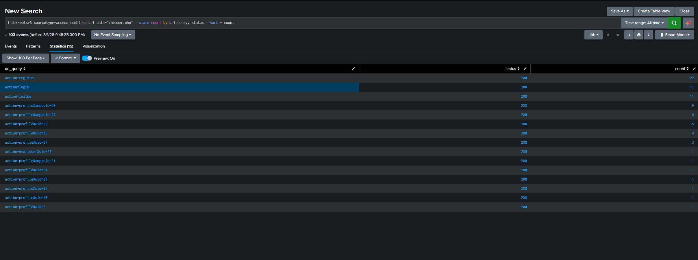

Result: 102 events total. `action=register` (22), `action=login` (11), `action=lostpw` (11),the 
rest are profile views. **Every single event returned HTTP 200.**

**Key lesson:** status code does not separate success from failure on this app - the server
returns 200 whether or not the credentials were valid. A common trap.

---

## Execute

### Step 1 - Are there any login *attempts* (POST) on the web app?

```
index=botsv3 sourcetype=access_combined uri_path="/member.php" | stats count by method, uri_query
```
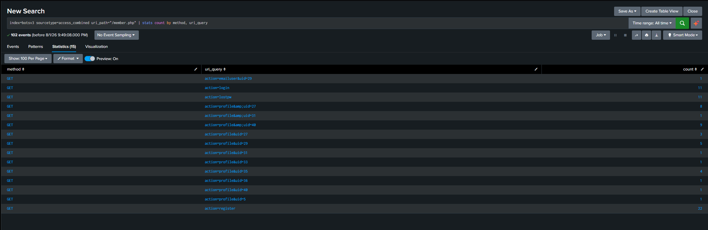

**Result: 100% GET, zero POST.**

Credential submission always happens via POST (the form body carries username/password).
GET requests only *display* the login page. So the 11 `action=login` events are 11 people
**viewing** the login form, not 11 password attempts. **No brute-force traffic on member.php.**

### Step 2 - Is there any other login surface on the web app?

```
index=botsv3 sourcetype=access_combined uri_path="*login*" | stats count by uri_path, method | sort - count
```
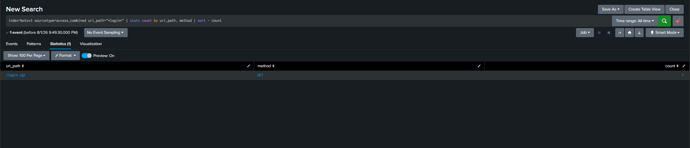

**Result: a single `/login.cgi` GET request.** No other login endpoints, no POST volume.
The web layer is clean.

### Step 3 - Pivot to the VPN layer (cisco:asa)

Web being clean doesn't mean brute-force doesn't exist; it may just be the wrong layer.
`cisco:asa` (80,192 events) is the firewall/VPN, a classic brute-force target.

New data source → discover its fields first (its schema is nothing like web logs):
```
index=botsv3 sourcetype=cisco:asa | fieldsummary | table field count
```
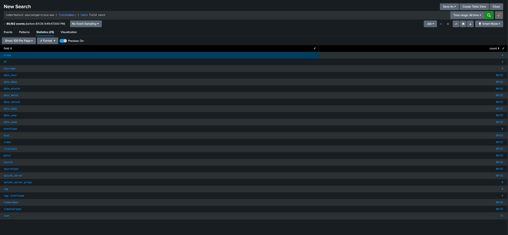

**Key observation:** most fields appear in all 80,192 events (generic metadata), but
`Group`, `IP`, and `Username` appear in **only 4 events**. Authentication events are the ones
carrying a username, so this environment contains just 4 user-authentication records.

### Step 4 - Examine those 4 authentication events

```
index=botsv3 sourcetype=cisco:asa Username=* | table _time, Username, IP, _raw
```
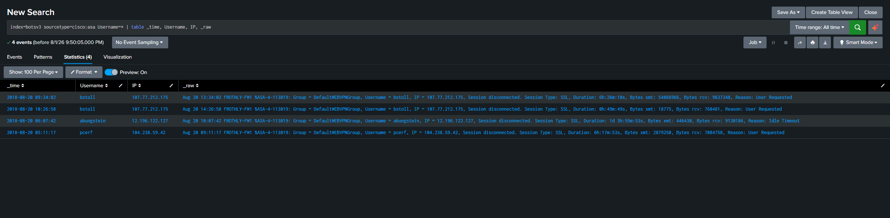

All four are `%ASA-4-113019` - **VPN session disconnected** events, not login attempts:

| User | Duration | Reason |
|------|----------|--------|
| bstoll | 6h 26m | User Requested |
| bstoll | 49m | User Requested |
| abungstein | 1d 3h 55m | Idle Timeout |
| pcerf | 6h 17m | User Requested |

**Verdict on these:** legitimate users. The durations are decisive - brute-force sessions
last milliseconds (try/reject/retry), not hours. These are multi-hour work sessions
transferring megabytes of data. No failed attempts among them.

### Step 5 - Visibility check: are failed logins even logged?

Before declaring "no brute-force," confirm we *could* see it. (Absence of evidence is only
evidence of absence if the data source is actually collecting it.)

```
index=botsv3 sourcetype=cisco:asa (113005 OR "authentication rejected" OR "AAA user authentication Rejected") | stats count
```
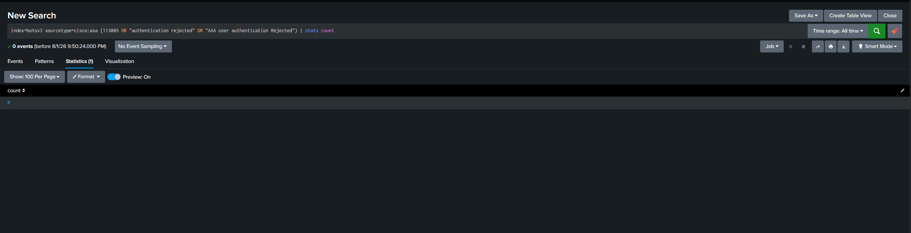

**Result: 0 events.** No failed-authentication records at all.

A broader search (`Rejected OR denied OR "authentication failed" OR 113005`) returned
**20,747 events** - alarming at first glance. But breaking it down by Cisco message code:

```
index=botsv3 sourcetype=cisco:asa (Rejected OR denied OR "authentication failed" OR 113005)
| rex field=_raw "%ASA-\d+-(?<msg_code>\d+)"
| stats count by msg_code | sort - count
```
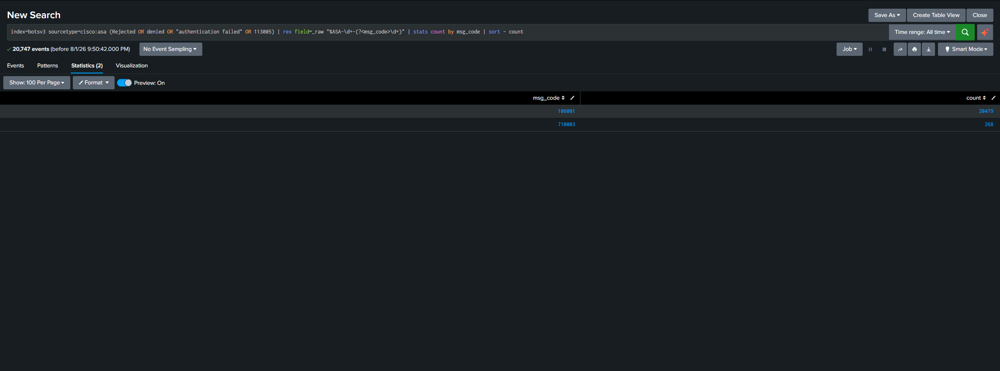

| msg_code | count | meaning |
|----------|-------|---------|
| 106001 | 20,479 | Inbound TCP connection denied - routine firewall filtering |
| 710003 | 268 | Management access denied |
| **113005** | **0** | **Failed authentication - none** |

**Note:** a big number is not a finding. Broad OR searches sweep up unrelated noise;
98% of those "denied" events were the firewall doing its normal job at the *connection*
layer, not the *authentication* layer.

---

## Verdict

**Hypothesis disproved for the layers examined.** No evidence of brute-force authentication on the web or VPN authentication surfaces,
confirmed across three independent checks:

1. **Web login:** zero POST requests to any login endpoint; only 11 login-page views and a single `/login.cgi` GET.
2. **VPN:** only 4 authentication-related records, all legitimate multi-hour user sessions (verified by session duration and byte counts).
3. **Failed-auth search:** zero `113005` events; the 20,747 "denied" events were connection-level firewall denials, not login failures.

## Visibility gap (the real finding)

The environment contains **no failed-authentication logs whatsoever** on the ASA. Two possible readings:

- there genuinely were no failed logins, or
- **AAA authentication logging is not enabled** on the ASA, and failed attempts would be invisible even if they occurred.

This is the actionable output of the hunt: a **detection blind spot**. A brute-force attack against
the VPN today would likely leave no trace we could hunt. Recommendation: enable/verify AAA
authentication logging (`%ASA-6-113004/113005`) so that future brute-force hunts have data to work with.

## Detection idea (deferred)

A brute-force detection cannot be built on this data because the required signal (failed auth
events) isn't collected. Once AAA logging is enabled, the rule would be:
*alert when a single source produces N failed authentications within a short window, especially
if followed by a success from the same source.*

## Important Notes

- **Status codes lie on login pages.** 200 means "request processed," not "login succeeded."
- **GET vs POST is the real discriminator** for credential submission on web apps.
- **Every sourcetype has its own schema.** `status`/`method` don't exist in `cisco:asa`; its
  success/failure lives inside the raw message and its Cisco message code.
- **Prove visibility before declaring absence.** "No evidence" only means something if the
  data source collects that evidence.
- **Big numbers aren't findings.** Break them down (here: `rex` on message codes) before reacting.
- **A disproved hypothesis is a successful hunt** especially when it surfaces a logging gap.


---

# Part 2 - Closing the Scope Gap: Cloud & Database Layers

The original hunt covered web and VPN authentication and explicitly listed cloud and database
layers as unexamined. This section closes that gap, testing the same hypothesis against
`aws:cloudtrail` and `aws:rds:audit`.

## Recon — authentication in two new sources

**CloudTrail:** 113 distinct API actions across 6,571 events. Authentication = `eventName=ConsoleLogin`.

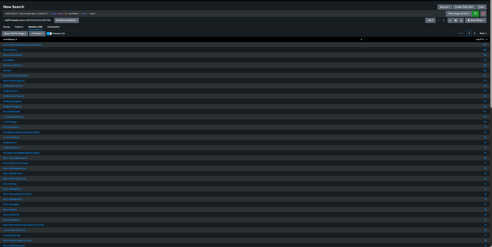

A field-parsing problem appeared immediately: `stats count by userName` returned **0 rows despite
4 matching events**. CloudTrail is nested JSON and the AWS TA isn't installed, so the values exist
in raw text but aren't queryable as fields. Workaround: read raw events directly.

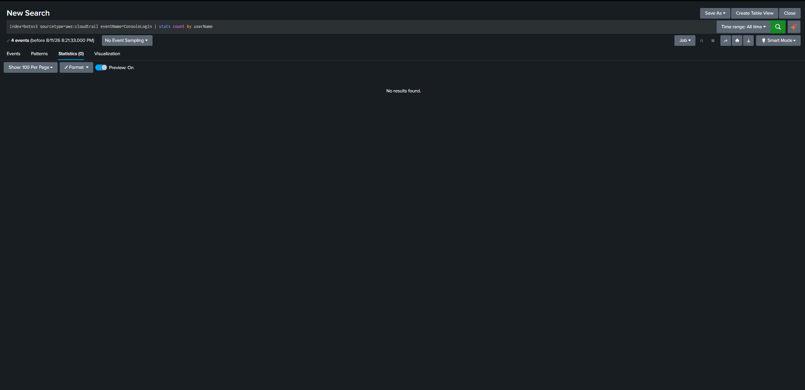

**RDS audit:** CSV-like format, not JSON:
```
20180820 14:54:02,ip-10-2-1-63,rdsadmin,localhost,35209,908272,QUERY,mysql,'SELECT ...',0
```
Fields: `timestamp | server | user | source host | connection id | query id | operation | database | query | result_code`

Database authentication = the `CONNECT` operation; success/failure lives in the final
`result_code` (**0 = success, non-zero = failure**).

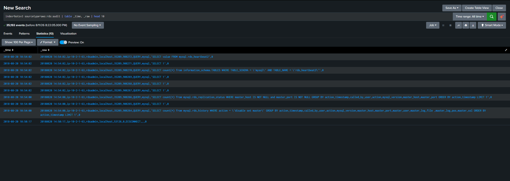

## Layer 3 - AWS Console logins

```
index=botsv3 sourcetype=aws:cloudtrail eventName=ConsoleLogin | table _time, _raw
```
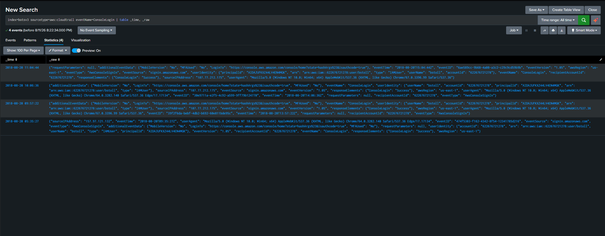

Only **4 ConsoleLogin events** in the entire dataset. All four: user `bstoll` (the same user seen
in the VPN sessions above), `"ConsoleLogin": "Success"` — zero failures, Chrome/Edge user agents,
from `107.77.212.175` (×3, matching his VPN IP) and `157.97.121.132` (×1). Also: `"MFAUsed": "No"`.

Normal workday activity. Brute-force would produce dozens of `"Failure"` records — there are none.

## Layer 4 - Database connections

```
index=botsv3 sourcetype=aws:rds:audit CONNECT | stats count by _raw | sort - count | head 20
```
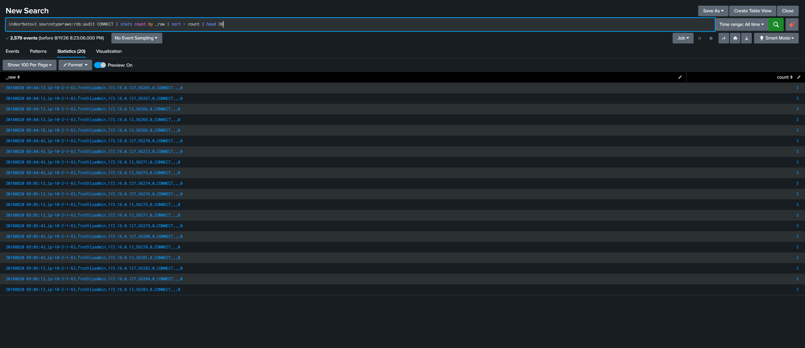

**2,579 CONNECT events, every one ending in `result_code = 0`.** Zero failed authentications.

The raw pattern explains itself: user `frothlyadmin` connecting from internal IPs `172.16.0.127`
and `172.16.0.13` at rigid 30-second intervals (09:04:13, 09:04:43, 09:05:13, 09:05:43…).
Machine-precise regularity = **application connection pool**, not a human or an attacker.

## Final verdict - all four authentication surfaces

| Layer | Sourcetype | Result |
|---|---|---|
| Web application | `access_combined` | No POST to any login endpoint → no attempts |
| VPN / firewall | `cisco:asa` | 4 legitimate multi-hour sessions; no failed-auth logs at all |
| AWS Console | `aws:cloudtrail` | 4 successful logins, zero failures |
| Database | `aws:rds:audit` | 2,579 successful connections, zero failures |

**No evidence of brute-force activity anywhere in Frothly's authentication surfaces.** The
remaining sourcetypes (network flow, metrics, config, endpoint telemetry) contain no
authentication events and are out of scope by definition. The hypothesis is now fully closed.

## Additional security observations

1. **No MFA on AWS Console** — `"MFAUsed": "No"` on all four IAM console logins. If `bstoll`'s
   password were compromised, nothing would stop the attacker. *Recommendation: enforce MFA on IAM users.*
2. **Two source IPs for one user, same day** — not suspicious in isolation, but worth an
   "impossible travel" detection while MFA stays off.
3. **Second visibility gap — AWS TA missing.** CloudTrail's nested JSON isn't field-extracted, so
   field-based queries silently return nothing. Combined with the ASA failed-auth gap above, this
   environment has **two significant authentication blind spots**.

## Detection idea (database layer)

Unlike the ASA and CloudTrail layers, the database layer *has* the required signal today:
*alert when a single source produces N `CONNECT` events with non-zero `result_code` in a short
window, especially if followed by a `result_code=0` from the same source.*

## Additional lessons

- **Every data source encodes "login" differently.** Web = POST to a login endpoint; VPN = ASA
  message codes; CloudTrail = `eventName=ConsoleLogin` + `responseElements`; database = `CONNECT`
  + `result_code`. Same hypothesis, four translations. Learning each source's own language *is* the job.
- **Events > 0 but stats = 0 means a field problem, not a data problem.** Nested JSON without the
  right TA looks like "no results" - fall back to `table _time, _raw` and read it yourself.
- **Recognize automation by rhythm.** Rigid 30-second intervals are a connection pool. Humans and
  attackers are irregular; machines are metronomes.
- **The simple query is usually enough.** `stats count by _raw` answered the same question as a
  `rex`-based version. Reach for regex only when the simple path fails.


## Layers 5 & 6 - Windows and network-level HTTP (closing the last gaps)

The scope section originally listed two unexamined surfaces. Both were subsequently checked.

**Windows authentication** - the environment *does* collect Windows security logs
(`wineventlog:security`, 46,469 events; plus `winhostmon` and Sysmon):

```
index=botsv3 sourcetype=wineventlog:security (EventCode=4625 OR EventCode=4624) | stats count by EventCode
```

| EventCode | Meaning | Count |
|---|---|---|
| 4624 | Successful logon | 427 |
| 4625 | **Failed logon** | **3** |

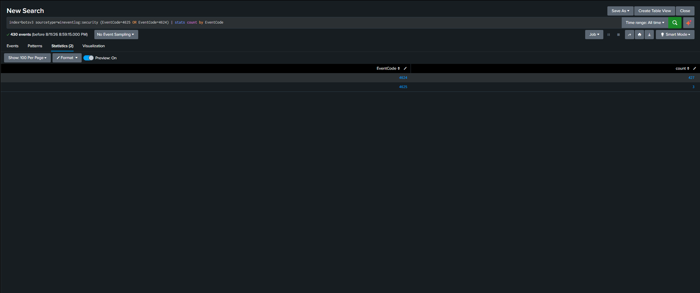

Three failed logons across the entire dataset — ordinary user typos, not brute-force. 
Note this also means Windows auth visibility is healthy here, unlike the ASA gap noted earlier.

**Network-level HTTP POSTs** - `stream:http` does contain POSTs that `access_combined` didn't show:

```
index=botsv3 sourcetype=stream:http | stats count by http_method
```
GET 9,908 · POST 261 · HEAD 43 · PROPFIND 2

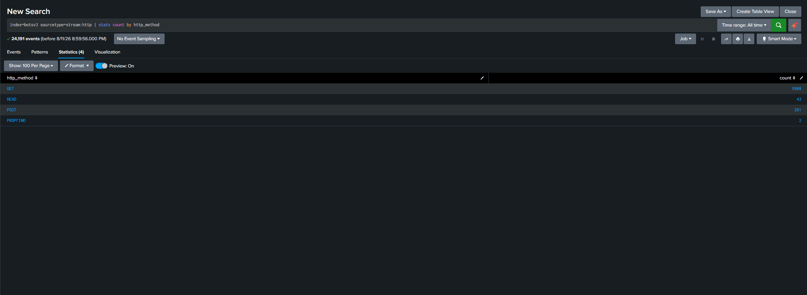

Reviewing where those 261 POSTs go (`stats count by site, uri_path`), they are ordinary web
activity: forum posting (`newthread.php`), form submissions, third-party sites. No concentration
of POSTs against a login endpoint.

**Both remaining gaps are now closed. Six authentication surfaces examined; no brute-force anywhere.**

## Scope & limitations (full hunt)

All identified authentication surfaces in this environment have been examined: web application,
VPN, AWS Console, database, Windows, and network-level HTTP. The remaining ~100 sourcetypes
(network flow, metrics, config, endpoint telemetry) contain no authentication events and are out
of scope by definition.
