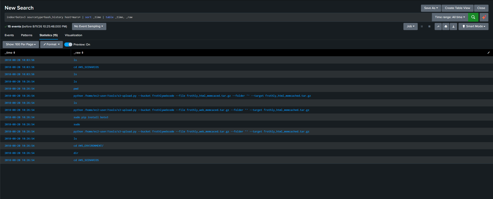
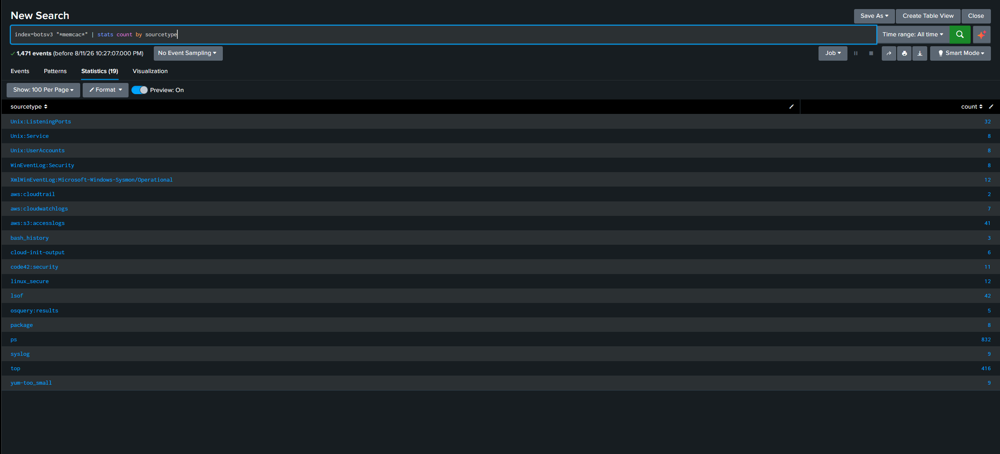
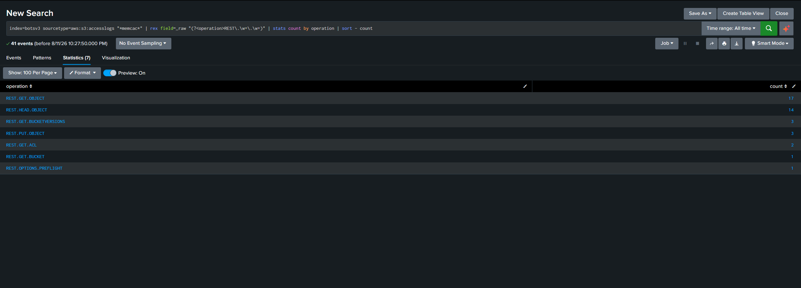
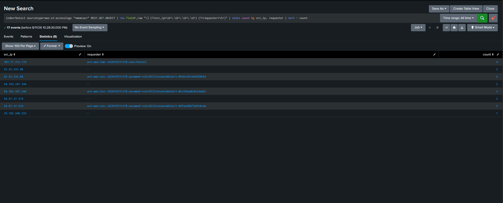
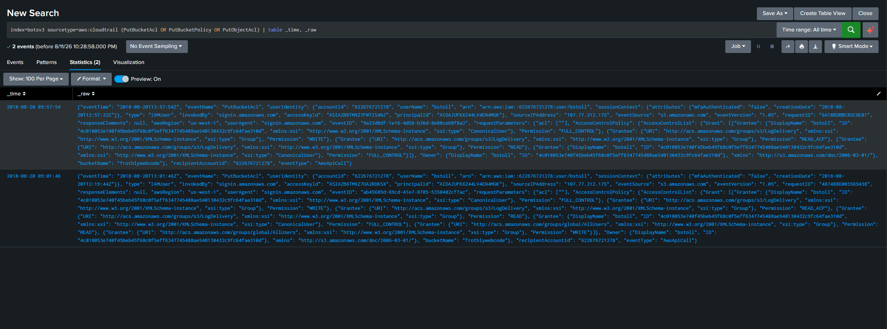
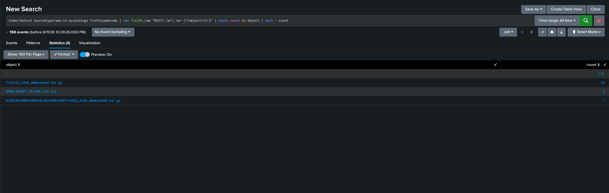

# Hunt #02 Public S3 Bucket Exposure (`frothlywebcode`)

**Type:** Hypothesis-driven, pivot-led (PEAK)
**Environment:** Splunk BOTS v3 (Frothly), all-time
**Threat Hunter:** Batuhan Akcal
**Status:** Closed **hypothesis confirmed, finding validated**

---

## How this hunt started

Unlike Hunt #01, this hunt did not begin with a threat-intel topic. It began with an
**observation in the data**: while reviewing `bash_history`, a command stood out on host `mars`:

```
python /home/ec2-user/tools/s3-upload.py --bucket frothlywebcode --file frothly_web_memcaced.tar.gz --target frothly_html_memcached.tar.gz
```

An archive being pushed to cloud storage is exactly what data exfiltration looks like
(MITRE **T1567.002 Exfiltration to Cloud Storage**). It is also exactly what a normal
deployment looks like. That ambiguity is the hunt.



Notable detail: the command was run three times with varying `--file` values and a
`sudo pip install boto3` in between a human operator, typos and all, not automation.

## Hypothesis

> **If** the `frothlywebcode` bucket was exposed or misused,
> **then** S3 access logs will show access to this file that cannot be explained by
> Frothly's own infrastructure, specifically requests without an authenticated identity.

## ABLE

| | |
|---|---|
| **Actor** | Unspecified. Could be an insider, an external scanner, or a misconfiguration with no actor at all. |
| **Behavior** | Data staged into cloud storage and retrieved by parties outside the organization (T1567.002 / T1530 Data from Cloud Storage Object). |
| **Location** | `aws:s3:accesslogs`, `aws:cloudtrail`, `bash_history`. |
| **Evidence** | S3 requester field: an IAM/STS ARN means authenticated; a bare `-` means **anonymous**. Anonymous GETs against a corporate bucket are not normal. |

**Stop condition:** determine whether the file was accessed by unauthenticated parties, and if
so, when and why the bucket allowed it. Content-level analysis of the archive itself is out of
scope (Splunk holds logs, not file contents).

---

## Execute

### Step 1: Pivot on the filename across all data

The filename is the entity here, not an IP. Field-blind search across the whole index:

```
index=botsv3 "*memcac*" | stats count by sourcetype
```


19 sourcetypes, 1,471 events. Most of it is noise from the **memcached service** itself
(`ps` 832, `top` 416, `lsof`, `Unix:ListeningPorts`) Frothly runs memcached, so the string
appears in process listings. The relevant hits:

| Sourcetype | Count | Why it matters |
|---|---|---|
| `aws:s3:accesslogs` | 41 | The file actually reached S3 |
| `aws:cloudtrail` | 2 | Bucket-level API activity |
| `code42:security` | 11 | A DLP/backup product observed the file |
| `bash_history` | 3 | The upload commands |

### Step 2: What happened to the file in S3?

```
index=botsv3 sourcetype=aws:s3:accesslogs "*memcac*"
| rex field=_raw "(?<operation>REST\.\w+\.\w+)"
| stats count by operation | sort - count
```


| Operation | Count |
|---|---|
| `REST.GET.OBJECT` | **17** |
| `REST.HEAD.OBJECT` | 14 |
| `REST.GET.BUCKETVERSIONS` | 3 |
| `REST.PUT.OBJECT` | **3** |
| `REST.GET.ACL` | 2 |
| `REST.GET.BUCKET` | 1 |
| `REST.OPTIONS.PREFLIGHT` | 1 |

**Three uploads, seventeen downloads.** A deployment artifact being pulled six times more often
than it is pushed deserves an explanation. (Note: in S3, uploads are `PUT`, not `POST`; the
form-style `POST` of web apps doesn't apply here.)

### Step 3: Were the downloads authenticated?

This is the decisive test. In S3 access logs, the requester field carries an IAM/STS ARN for
authenticated calls and a bare `-` for anonymous ones:

```
index=botsv3 sourcetype=aws:s3:accesslogs "*memcac*" REST.GET.OBJECT
| rex field=_raw "\] (?<src_ip>\d+\.\d+\.\d+\.\d+) (?<requester>\S+)"
| stats count by src_ip, requester | sort - count
```


| Source IP | Requester | Count |
|---|---|---|
| 107.77.212.175 | `arn:aws:iam::622676721278:user/bstoll` | 4 |
| 52.53.233.88 | **`-` (anonymous)** | **2** |
| 52.53.233.88 | `assumed-role/EC2InstanceRole` | 2 |
| 54.183.247.244 | **`-` (anonymous)** | **2** |
| 54.183.247.244 | `assumed-role/EC2InstanceRole` | 2 |
| 54.67.37.214 | **`-` (anonymous)** | **2** |
| 54.67.37.214 | `assumed-role/EC2InstanceRole` | 2 |
| 35.182.246.222 | **`-` (anonymous)** | **1** |

**7 of 17 downloads were anonymous.** The bucket was serving this object to the internet without
authentication. `35.182.246.222` is particularly notable: anonymous only, no matching EC2 role,
using `aws-cli` from outside Frothly's infrastructure.

**Hypothesis confirmed.** Now: why was it open, and for how long?

### Step 4: Who opened the bucket, and when?

```
index=botsv3 sourcetype=aws:cloudtrail (PutBucketAcl OR PutBucketPolicy OR PutObjectAcl)
| table _time, _raw
```


Exactly two events, same user, same source IP: one opening the bucket, one closing it.

**09:01:46 bucket opened:**
```json
"userName": "bstoll",  "eventName": "PutBucketAcl",  "bucketName": "frothlywebcode",
"sourceIPAddress": "107.77.212.175",  "mfaAuthenticated": "false",
"Grantee": {"URI": ".../groups/global/AllUsers"}, "Permission": "READ",
"Grantee": {"URI": ".../groups/global/AllUsers"}, "Permission": "WRITE"
```

`global/AllUsers` is AWS's "everyone on the internet." The grant included **WRITE as well as
READ**, meaning anyone could not only download from the bucket but also upload to it.

**09:57:54 bucket closed:** the same API call, same user, with `AllUsers` removed from the
grant list. Only `bstoll` and `LogDelivery` remain.

### Step 5: Impact: what was in the bucket?

Splunk holds logs, not file contents, so the archive itself can't be opened. But the bucket
inventory answers the question indirectly:

```
index=botsv3 sourcetype=aws:s3:accesslogs frothlywebcode
| rex field=_raw "REST\.\w+\.\w+ (?<object>\S+)"
| stats count by object | sort - count
```


| Object | Count |
|---|---|
| `-` (bucket-level operations) | 131 |
| `frothly_html_memcached.tar.gz` | 24 |
| **`OPEN_BUCKET_PLEASE_FIX.txt`** | **2** |

**Someone found the open bucket and left a file in it.** The name says it outright:
*OPEN_BUCKET_PLEASE_FIX*. This is a well-known internet phenomenon for scanners and researchersto 
sweep for publicly writable S3 buckets and drop warning files in the ones they find.

This single object proves three things at once:
1. The exposure was discovered by a third party, not just theoretically possible.
2. The **WRITE** grant was genuinely exploitable; someone wrote to Frothly's bucket.
3. It happened fast enough to land inside a 56-minute window.

---

## Timeline

| Time (2018-08-20) | Event |
|---|---|
| 09:01:46 | `bstoll` grants `AllUsers` **READ + WRITE** on `frothlywebcode` (MFA: false) |
| 09:03:46 | Anonymous `GET` of `frothly_html_memcached.tar.gz` |
| 09:04:17 | `PUT` archive uploaded (35.182.246.222) |
| 09:33:34–09:33:38 | Multiple anonymous + EC2-role downloads |
| ~09:5x | `OPEN_BUCKET_PLEASE_FIX.txt` appears in the bucket |
| 09:59:18 | `bstoll` starts checking permissions (`REST.GET.ACL`, `GET.BUCKETVERSIONS`) |
| 09:57:54 | `bstoll` removes `AllUsers` bucket closed |

**Exposure window: ~56 minutes.** Seven anonymous downloads and at least one anonymous write
occurred inside it.

## Verdict

**Confirmed finding public S3 bucket exposure with third-party access.**

On 2018-08-20, the IAM user `bstoll` granted `AllUsers` (public internet) both READ and WRITE
permissions on the `frothlywebcode` bucket, from an **MFA-unauthenticated session**. During the
~56-minute exposure window, the bucket's contents were downloaded anonymously seven times, and an
external party wrote a file into it (`OPEN_BUCKET_PLEASE_FIX.txt`) demonstrating the write
permission was exploitable. The user detected the issue himself and revoked the grant.

**Assessment: misconfiguration, not malicious insider activity.** The pattern — open, brief
window, self-detection via ACL checks, self-remediation is consistent with an administrative
mistake rather than deliberate exfiltration. But the exposure was real and was found by someone
outside the organization.

## Impact

`frothlywebcode` is a web-code/deployment bucket; the only real object is a 3 MB web archive
(`frothly_html_memcached.tar.gz`). No customer data or credentials were identified in the bucket
inventory, so this is **not a data breach of sensitive records**.

The severity is on the **integrity** side, not confidentiality:

1. **WRITE access to a deployment bucket is a supply-chain risk.** An attacker could have
   replaced the web archive with a malicious version, which would then be deployed to Frothly's
   website and served to every visitor. This is materially worse than the data being read.
2. **Exploitability was proven**, not theoretical; a third party successfully wrote to the bucket.
3. The web archive itself left the organization seven times; if it contains configuration files
   or embedded credentials, that is a secondary exposure requiring review.

## Recommendations

1. **Enable S3 Block Public Access** at the account level so `AllUsers` grants cannot be applied
   to any bucket, regardless of individual user action.
2. **Enforce MFA on IAM users.** This change was made from a session with `mfaAuthenticated: false`
   the same gap identified in Hunt #01.
3. **Alert on `PutBucketAcl` / `PutBucketPolicy` containing `AllUsers` or `AuthenticatedUsers`.**
   This is a high-signal, low-noise detection (see below).
4. **Review the contents of the exposed archive** for embedded configuration or credentials.
5. **Investigate the origin of `OPEN_BUCKET_PLEASE_FIX.txt`** and confirm nothing else was written
   or modified during the window.

## Detection

Unlike Hunt #01, the required signal exists in this environment today. Two complementary rules:

**Rule 1 public grant (preventive, fires at the moment of exposure):**
```
index=botsv3 sourcetype=aws:cloudtrail (eventName=PutBucketAcl OR eventName=PutBucketPolicy)
"global/AllUsers"
| table _time, userName, sourceIPAddress, bucketName
```
Very low false-positive rate: legitimately granting the whole internet access to a corporate
bucket is almost never intentional. This is the rule that would have caught the incident at
09:01:46 instead of 56 minutes later.

**Rule 2 anonymous object access (detective, fires when exposure is used):**
```
index=botsv3 sourcetype=aws:s3:accesslogs
| rex field=_raw "\] (?<src_ip>\d+\.\d+\.\d+\.\d+) (?<requester>\S+)"
| where requester="-"
| stats count dc(src_ip) as distinct_sources by bucket
```
Catches the case where a bucket is public via policy rather than ACL, or where the grant
predates the monitoring window.

## Lessons learned

- **A hunt can start from an observation, not a topic.** Hunt #01 started with a threat technique
  (brute force) and found nothing. This one started with a single odd command in `bash_history`
  and found a real incident. Both are valid PEAK entry points, but ambient anomalies in your own
  data are often the richer source.
- **Pivot on the entity, whatever the entity is.** The pivot technique that worked on an IP in
  earlier work worked identically on a *filename*. The entity is whatever ties events together.
- **In cloud logs, identity is the discriminator.** Volume told me nothing (3 uploads, 17
  downloads is just a number). The `-` in the requester field is what turned counting into a
  finding. Learn each source's success/identity semantics before hunting in it.
- **Broad search terms sweep in noise.** `*memcac*` matched the memcached *service* as well as the
  filename 832 hits in `ps` alone. Always separate the string you meant from the string you got.
- **Not every finding is an attacker.** The most likely reading here is an administrator's mistake.
  A hunter's job is to report what the evidence supports, not to promote a misconfiguration into
  an intrusion. The severity comes from the WRITE grant and the proven third-party access, not
  from an assumed adversary.
- **The impact question is part of the hunt.** "The bucket was open" is incomplete. "The bucket was
  open, it held deployment code, WRITE was granted, and someone used it" is a finding a business
  can act on.
