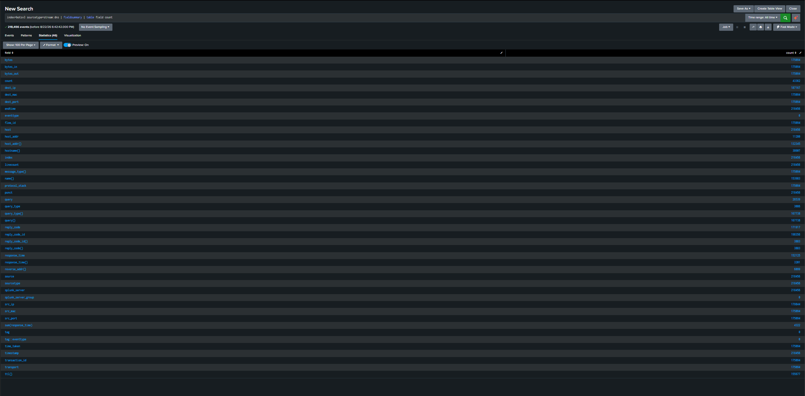
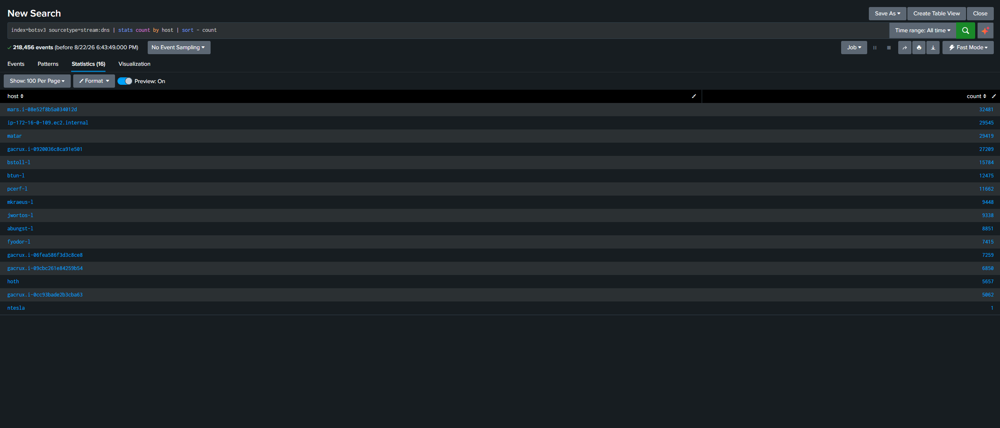
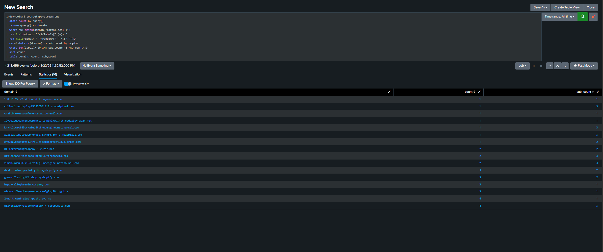
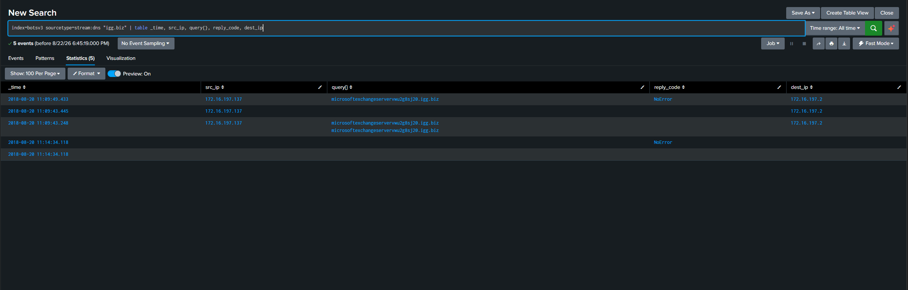
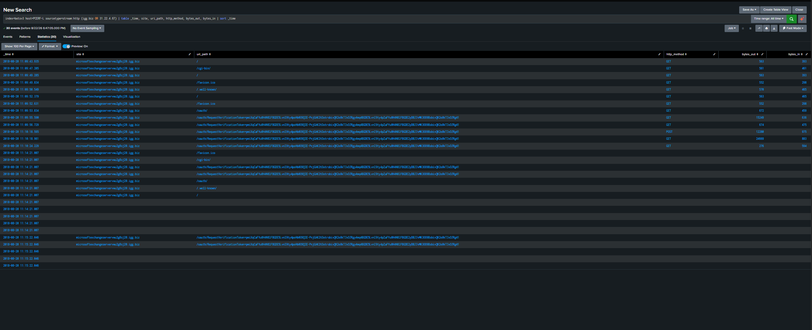
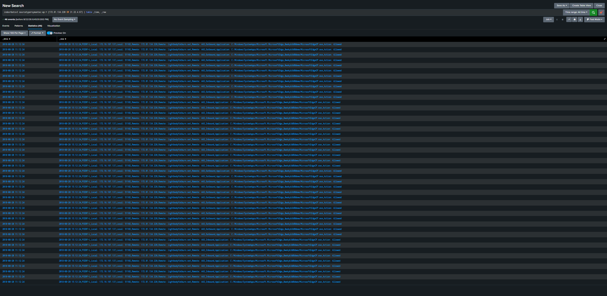
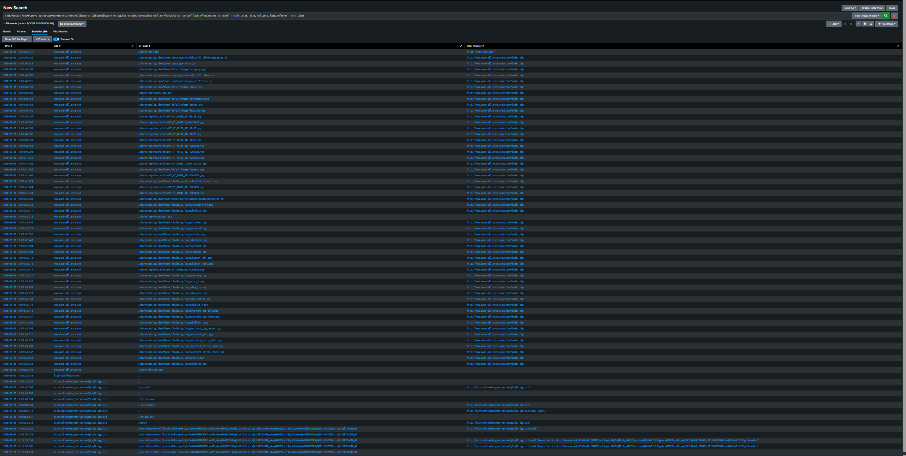

# Hunt #03 DNS Baseline Hunt: Discovering C2 Through Statistical Anomaly

**Type:** Baseline hunt (PEAK) → escalated to incident
**Environment:** Splunk BOTS v3 (Frothly), all-time
**Threat Hunter:** Batuhan Akcal
**Status:** Closed **malicious activity confirmed**

---

## Why a baseline hunt

Hunts #01 and #02 were hypothesis-driven: I started with a threat technique or a specific
observation and tested it. This hunt used PEAK's second type, **baseline hunting**, where you
start with no target at all. You characterize what "normal" looks like in a dataset, then hunt
whatever fails to fit.

DNS was chosen deliberately:
- **High volume** (218,456 events) enough data for statistics to mean something
- **Universal coverage** every host resolves names, so nothing hides by not participating
- **Attackers can't avoid it** malware reaching a C2 server must resolve its address first

No IOC list, no threat intel feed, no alert. Just: *what is normal here, and what isn't?*

---

## Phase 1: Data dictionary

```
index=botsv3 sourcetype=stream:dns | fieldsummary | table field count
```



46 fields across 218,456 events. The ones that matter for hunting:

| Field | Meaning | Why it matters |
|---|---|---|
| `src_ip` | Querying host | Primary baseline dimension |
| `query{}` | Domain requested | The core artifact |
| `query_type{}` | Record type (A, AAAA, TXT…) | TXT is the tunneling favourite |
| `reply_code` | NoError / NXDOMAIN | NXDOMAIN storms indicate DGA |
| `bytes`, `bytes_in/out` | Query size | Tunneling inflates these |

Note: fields ending in `{}` are **multi-value** a single DNS event can carry several
queries/answers, stored as an array.

## Phase 2: Establish normal

**Host distribution** (16 hosts, two natural groups):

| Group | Hosts | Query volume |
|---|---|---|
| Servers | mars, gacrux×4, matar, hoth, ip-172-16-0-109 | 5,000–32,000 |
| User laptops | BSTOLL-L, BTUN-L, PCERF-L, MKRAEUS-L, JWORTOS-L, ABUNGST-L, FYODOR-L | 7,000–15,000 |
| Outlier | **ntesla** | **1** |



Two groups means **two baselines**: a server making 30,000 queries is normal, a laptop doing
the same would not be. (`ntesla` with a single query was noted and parked; not this hunt.)

**Domain distribution** 5,063 unique domains, 176,831 queries. A classic long tail:

```
splunk.froth.ly                    130,946   ← 74% of all traffic
polaris...rds.amazonaws.com          4,704
sv5dc01.splunk.local                 2,304
wpad.localdomain                     1,683
_ldap._tcp...splunk.local            1,664
```

The top of the list is pure infrastructure: forwarders phoning home, AD/LDAP, WPAD, Office365,
AWS internal. **This is what healthy corporate DNS looks like.** Now anything that doesn't fit
this shape becomes visible.

## Phase 3: Hunt the anomaly (three techniques)

No single statistic is trusted; three angles were applied to the same data.

**a) Domain length** DNS tunneling encodes data into subdomains, inflating name length.
Median 25 chars, max 75. The longest entries were `ip6.arpa` reverse lookups and mDNS printer
names, all legitimate. **No tunneling signature.**

**b) Subdomain cardinality** tunneling's second signature: hundreds of random subdomains under
one registered domain.

| Registered domain | Distinct subdomains |
|---|---|
| in-addr.arpa | 2,731 (reverse DNS normal) |
| outlook.com | 161 |
| froth.ly | 70 |

Nothing anomalous. **No tunneling.**

**c) Entropy analysis** This is what produced the finding. Entropy measures randomness in a
string: `google` scores low (a real word), `x7k2mq9pz` scores high. DGA malware generates random
names, so entropy surfaces them without needing a blocklist.

Sorting the domain list by rarity and inspecting high-entropy labels, one result stood out:

```
microsoftexchangeservervwu2g8sj20.igg.biz     3 queries
```



Suspicious on two independent grounds:
1. **Impersonation** "microsoftexchangeserver" followed by a random suffix. Deliberately built
   to look like Microsoft infrastructure in a log review.
2. **Infrastructure** `igg.biz` is not a Microsoft domain. It's a free dynamic-DNS provider,
   commonly used for disposable C2 because it costs nothing and requires no identity.

And only **3 queries** are the *least-frequently-occurring* principle. Noise repeats; attacks
are rare.

## Phase 4: Validate the anomaly

```
index=botsv3 sourcetype=stream:dns "igg.biz" | table _time, src_ip, query{}, reply_code, dest_ip
```



| Attribute | Value |
|---|---|
| Source | **172.16.197.137** (host `PCERF-L`, a user laptop) |
| Resolved to | **31.22.4.67 / 31.22.4.68** |
| Name servers | `ns1.byethost15.org`, `ns2.byethost15.org` |
| Reply code | **NoError** the domain resolves; infrastructure is live |

Free dynamic DNS pointing at free hosting, wearing a Microsoft costume. The profile is coherent:
**cheap, disposable, disguised.**

## Phase 5: Eliminate the false positive

Pivoting to `PCERF-L` surfaced Symantec endpoint data: 419 behavior events, **18 marked
"Blocked"**, including:

```
[AC7-2.1] Block scripts - Caller MD5=bf01cb424cafaf985bcca2a26aa48cd4
```

A blocked script on the same host as a suspicious C2 lookup looks like a smoking gun. It wasn't.
Searching the hash across the whole index:

```
index=botsv3 "bf01cb424cafaf985bcca2a26aa48cd4"
```

The hash belongs to **`splunkd.exe`**, and the "blocked scripts" were Splunk's own collectors:
`win_installed_apps.bat`, `win_listening_ports.bat`, `perfmon.cmd`, `winEventLog.cmd`. 1,543
occurrences. This also explained the `wmic os get LocalDateTime` / `reg query …Uninstall` volume
in Sysmon Splunk_TA_windows inventory scripts, not reconnaissance.

**Verdict on this lead: operational noise, not an attack.** Symantec's script-blocking policy is
interfering with Splunk's data collection a real operational finding, but a separate one.

> **Lesson:** "Blocked" is not a synonym for "threat stopped." Escalating on a status label
> without identifying *what* was blocked is a classic triage failure.

## Phase 6: Move to the HTTP layer

DNS shows what was *asked for*; HTTP shows what was *done*. This is where the hunt broke open.

```
index=botsv3 host=PCERF-L sourcetype=stream:http (igg.biz OR 31.22.4.67)
| table _time, site, uri_path, http_method, bytes_out, bytes_in | sort _time
```



```
11:09:43  GET  /                                             563 out
11:09:47  GET  /cgi-bin/                                     561 out
11:09:49  GET  /favicon.ico                                  552 out
11:09:50  GET  /.well-known/                                 570 out
11:09:53  GET  /oauth/                                       672 out
11:09:55  GET  /oauth/RequestVerificationToken=pmiXqCa…   15,249 out
11:10:18  POST /oauth/RequestVerificationToken=pmiXqCa…   12,280 out
11:10:18  GET  /oauth/RequestVerificationToken=pmiXqCa…   24,669 out
11:10:24  GET  /oauth/RequestVerificationToken=pmiXqCa…      276 out
```

Three independent indicators:

1. **Path probing in 10 seconds** `/cgi-bin/`, `/.well-known/`, `/oauth/`, `/favicon.ico`.
   No human browses like this. This is a C2 framework fingerprinting its own endpoint.
2. **Fake OAuth channel** `RequestVerificationToken=` followed by a long opaque string. The
   domain impersonates Exchange; the URI impersonates OAuth. **The disguise is consistent across
   layers**, which is itself a signal of deliberate design.
3. **24,669 bytes outbound on a GET.** A GET request normally sends a few hundred bytes and
   *receives* data. A client pushing 24 KB out on a GET is data leaving the network.

**Total outbound: ~53 KB in 40 seconds.**

## Phase 7: Scope and attribution

**Scope** only one host touched this infrastructure:

```
index=botsv3 (31.22.4.67 OR "igg.biz" OR 172.81.134.220 OR lightbodyfatburn)
| stats count by host, sourcetype
```

| Host | Sourcetype | Count |
|---|---|---|
| PCERF-L | stream:http / dns / tcp / ip | 75 |
| SEPM | symantec:ep:packet:file | 46 (log relay for PCERF-L) |
| splunkhwf.froth.ly | syslog | 8 (log relay) |

No lateral spread. `SEPM` and `splunkhwf` are collectors reporting *about* PCERF-L, not victims
a reminder that Splunk's `host` field sometimes identifies the relay rather than the origin.

**Process attribution** Sysmon should answer "which program made this connection" (EventID 3):

```
index=botsv3 host=PCERF-L sourcetype="XmlWinEventLog:…Sysmon/Operational" EventCode=3
```
**0 results.** Of 744 Sysmon events on this host, only 5 are EventID 3; network logging is
effectively disabled in the Sysmon configuration. **Visibility gap #1.**

Symantec filled the gap instead:
```
Remote: 172.81.134.220, lightbodyfatburn.net, 443, Outbound,
Application: C:/Windows/SystemApps/Microsoft.MicrosoftEdge_8wekyb3d8bbwe/MicrosoftEdge…
```



The traffic went through **`MicrosoftEdge.exe`**, the user's browser, and Symantec logged it as
**Allowed**. **Visibility gap #2 / control failure:** the endpoint product saw the C2 session and
did not block it.

> **Lesson:** different sources give different visibility. Sysmon was blind here; Symantec wasn't.
> Never rely on a single telemetry source to answer a single question.

## Phase 8: Reconstruct the chain (referrers)

The `http_referrer` field answers "how did the browser get here?" Ordering the suspicious traffic
chronologically produced the full attack path:

```
index=botsv3 host=PCERF-L sourcetype=stream:http
(mans-alliance OR lightbodyfatburn OR igg.biz OR platinum-casino)
earliest="08/20/2018:11:07:00" latest="08/20/2018:11:11:00"
| table _time, site, uri_path, http_referrer | sort _time
```

The time window is deliberate: `schuetze-consult.de` browsing dominates the earlier part of the
session and is unrelated. Narrowing to 11:07–11:11 isolates the compromise chain itself.



| Time | Site | Path | Referrer |
|---|---|---|---|
| 11:00:42 | schuetze-consult.de | /images, /right.gif | - (ordinary browsing) |
| 11:07:39 | www.mans-alliance.com | /store/index.php | **bing.com** (legitimate search) |
| **11:08:35** | **www.mans-alliance.com** | **/vorcnrid/yp1mn.ya6** | mans-alliance.com/store |
| **11:08:35** | **lightbodyfatburn.net** | / | - |
| 11:09:43 | igg.biz | / → /cgi-bin/ → /oauth/ | - |
| 11:10:18 | igg.biz | /oauth/RequestVerificationToken=… | C2 data transfer |
| 11:13:20 | lightbodyfatburn.net | / | second beacon |
| 11:14:06 | platinum-casino.ru | **/zver/sysfiles/bo** | - |
| 11:15:22 | igg.biz | /oauth/RequestVerificationToken=… | C2 continues |
| 11:17:31 | platinum-casino.ru | /sver.sysfiles/bo | - |

**11:08:35 is the moment of compromise.** The user arrived at `mans-alliance.com` from a Bing
search — legitimate behavior on a legitimate e-commerce site. Seconds later the browser requests
`/vorcnrid/yp1mn.ya6`: a random path with a non-standard extension that no user would click. In
the *same second*, contact with `lightbodyfatburn.net` begins.

This is the signature of a **drive-by compromise**: a legitimate site carrying injected script,
redirecting the visitor into an exploit/C2 chain. `platinum-casino.ru/zver/sysfiles/bo` is a
second stage; "zver" is a folder name common in Russian-language malware distribution kits.

Also noted: `piwik.alesco-concepts.com` was called from `schuetze-consult.de` — Piwik is analytics
software, frequently repurposed by attackers for victim tracking.

---

## Verdict

**Confirmed malicious activity drive-by compromise with active C2 on `PCERF-L`.**

On 2018-08-20 at 11:08:35, the host `PCERF-L` (172.16.197.137, user Peat Cerf) was compromised
through a drive-by chain originating from a legitimate e-commerce site (`mans-alliance.com`)
reached via Bing search. Within seconds the host began communicating with two C2 endpoints:
`lightbodyfatburn.net` (172.81.134.220) and `microsoftexchangeservervwu2g8sj20.igg.biz`
(31.22.4.67), the latter disguising itself as Microsoft Exchange infrastructure and its traffic
as OAuth token exchange. Approximately **53 KB of outbound data** was transferred over a
40-second window, including a 24 KB payload on a GET request consistent with data exfiltration.
Communication continued in bursts until at least 11:17.

**Scope:** one host. No lateral movement to other endpoints was observed.
**Control failure:** Symantec Endpoint Protection logged the C2 sessions as **Allowed**.

## MITRE ATT&CK mapping

| Tactic | Technique |
|---|---|
| Initial Access | **T1189** Drive-by Compromise |
| Command and Control | **T1071.001** Application Layer Protocol: Web Protocols |
| Command and Control | **T1568.002** Dynamic Resolution: Domain Generation Algorithms *(partial random suffix on an impersonated name)* |
| Command and Control | **T1071** masquerading C2 as OAuth/Exchange traffic |
| Exfiltration | **T1041** Exfiltration Over C2 Channel |

## Findings summary

| # | Finding | Severity |
|---|---|---|
| 1 | Active C2 on PCERF-L, ~53 KB exfiltrated | **High** |
| 2 | Symantec logged C2 traffic as Allowed control failure | **High** |
| 3 | Sysmon network logging (EventID 3) effectively disabled; no process attribution | **Medium** |
| 4 | Symantec's script-blocking policy is blocking Splunk's own collectors (1,543 events), degrading logging integrity | **Medium** |
| 5 | User laptops reaching gambling / compromised third-party sites; no web filtering in evidence | **Low–Medium** |

## Recommendations

1. **Isolate and reimage PCERF-L.** Active C2 with confirmed outbound data transfer.
2. **Block the C2 infrastructure** at the perimeter: `31.22.4.67`, `31.22.4.68`, `172.81.134.220`,
   and the domains `*.igg.biz`, `lightbodyfatburn.net`.
3. **Investigate why Symantec allowed the sessions** tune or escalate; a product that sees C2
   and permits it provides false assurance.
4. **Enable Sysmon EventID 3 (network connections)** across the estate. Without it, process
   attribution for network-based attacks is impossible.
5. **Resolve the Symantec/Splunk conflict** a security control degrading log collection is a
   detection risk in itself.
6. **Deploy web filtering / DNS filtering** for user endpoints; free dynamic-DNS domains
   (`*.igg.biz` and similar) have almost no legitimate business use.
7. **Review what left the network** 53 KB is small but non-trivial; determine what the browser
   session had access to.

## Detections developed

**Rule 1 impersonation on free dynamic DNS** (the signal that started this hunt):
```
index=botsv3 sourcetype=stream:dns
| rex field=query{} "(?<label>[^.]+)\.(?<tld>[^.]+\.[^.]+)$"
| where match(label, "(?i)(microsoft|exchange|office|outlook|windows|google|amazon)")
  AND match(tld, "(?i)(igg\.biz|byethost|ddns|no-ip|duckdns|hopto|serveo)")
| stats count values(src_ip) by query{}
```
A brand name on disposable DNS infrastructure is almost never legitimate. Very low false-positive rate.

**Rule 2 outbound-heavy GET requests** (catches C2 regardless of domain):
```
index=botsv3 sourcetype=stream:http http_method=GET
| eval ratio = bytes_out / (bytes_in + 1)
| where bytes_out > 5000 AND ratio > 3
| stats count sum(bytes_out) as total_out by src_ip, site
```
A GET should download, not upload. This is behavioral; it doesn't depend on knowing the domain.

**Rule 3 repeated path probing** (C2 framework fingerprint):
```
index=botsv3 sourcetype=stream:http
| bin _time span=1m
| stats dc(uri_path) as distinct_paths by src_ip, site, _time
| where distinct_paths >= 5
```
Five or more distinct paths on one site inside one minute is automation, not browsing. Threshold
requires tuning against the local environment (see Hunt #01's v1→v4 methodology).

## Lessons learned

- **Baseline hunting finds what you weren't looking for.** No IOC list, no intel feed, no alert
  just a statistical profile of normal and a search for what didn't fit. 218,456 events reduced to
  one 3-query anomaly, which unraveled into a full compromise.
- **Rarity is a signal.** The malicious domain appeared 3 times among 176,831 queries. Noise
  repeats; intrusions are quiet. Sorting *ascending* by count is as valuable as sorting in descending order.
- **Entropy beats blocklists.** This domain was on no threat feed I used. It was found because its
  *shape* was wrong: a brand name welded to a random string on free infrastructure.
- **Use several statistics, expect most to find nothing.** Length and cardinality analysis both
  came back clean; entropy found it. Running all three is what makes "nothing here" trustworthy.
- **Layers answer different questions.** DNS said *what was asked*. HTTP said *what was sent*.
  Symantec said *which process*. Referrers said *how it started*. No single layer would have told
  this story.
- **Eliminating a false positive is progress.** Hours could have been lost on Symantec's "Blocked"
  events. Hashing the caller resolved it in a single query, and the remaining leads grew stronger.
- **A control that logs but doesn't block is a false sense of security.** Symantec saw the C2 and
  allowed it. That's arguably as important a finding as the C2 itself.
